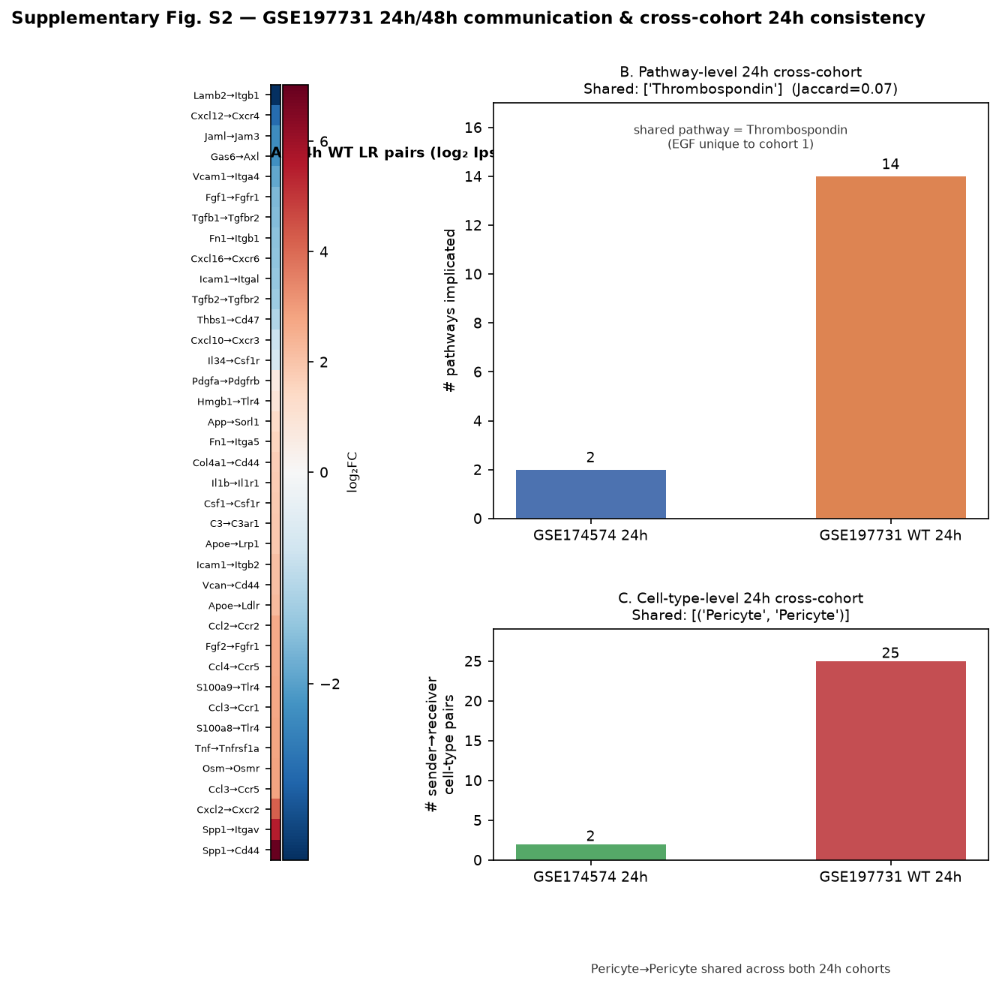

# Supplementary Materials

## Supplementary Tables
**Table S1.** Cross-cohort Spearman correlations for TF master-regulator rankings

| Comparison | Common TFs | Spearman ρ | p |
|---|---|---|---|
| Integrated vs cohort 1 | 251 | +0.517 | 1.5 × 10⁻¹⁸ |
| Integrated vs cohort 2 | 235 | +0.548 | 8.8 × 10⁻²⁰ |
| Cohort 1 vs cohort 2 | 242 | +0.482 | 1.7 × 10⁻¹⁵ |

**Table S2.** Cross-species regulatory convergence: structural enrichment of human ortholog targets

| TF (human) | Reference set | k/n | OR | Hypergeom. p | Emp. p (perm) |
|---|---|---|---|---|---|
| **SOX10** | myelin/oligo | 7/22 | 27.0 | 6.0 × 10⁻⁸ | 0.0005 |
| **CEBPB** | neuroinflammation | 8/23 | 16.5 | 3.2 × 10⁻⁷ | 0.024 |
| **GATA2** | neuroinflammation | 15/23 | 4.6 | 3.3 × 10⁻⁴ | 0.047 |

**Table S3.** Human stroke blood (GSE16561) module activation

| Module | targets (present/total) | Δ (stroke−control) | Cliff's δ | p |
|---|---|---|---|---|
| CEBPB (inflammation) | 555/589 | +0.058 | +0.89 | 3.8 × 10⁻⁹ |
| SOX10 (myelin/oligo) | 296/322 | +0.045 | +0.83 | 4.9 × 10⁻⁸ |
| GATA2 (inflammation) | 4780/5370 | +0.023 | +0.76 | 5.2 × 10⁻⁷ |

**Table S4.** Sox10 cKO (GSE269122): target program directional support

| TF program | n | mean log₂FC | OR↓ | Fisher p | Rank (most-negative) |
|---|---|---|---|---|---|
| **Sox10** (perturbed) | 319 | −0.090 | 1.81 | ≈ 0 | **46 / 412 (top 11 %)** |
| Cebpb (control) | 570 | −0.065 | 1.83 | ≈ 0 | 147 / 412 |
| Gata2 (control) | 5177 | −0.033 | 1.33 | ≈ 0 | 309 / 412 |
| Sox2 (control) | 3121 | −0.025 | 1.29 | ≈ 0 | 339 / 412 |

**Table S5.** Cebpb het-KO (GSE273163): target program directional support

| TF program | n | mean log₂FC | OR↓ | Fisher p | Rank (most-negative) |
|---|---|---|---|---|---|
| **Cebpb** (perturbed) | 555 | −0.172 | 1.20 | **0.022** | **149 / 404 (top 37 %)** |
| Gata2 (control) | 4889 | −0.147 | 1.15 | ≈ 0 | 205 / 404 |
| Sox10 (control) | 307 | −0.128 | 0.95 | 0.68 | 278 / 404 |

**Table S6.** SigCom LINCS: signature-match results

| Assay (SigCom LINCS) | Gene | Metric | Rank / total | p / percentile | Self-specific? | Note |
|---|---|---|---|---|---|---|
| OE mimicker | GATA2 | own OE signature mimics GATA2 target program | 3 / 33,782 (top 0.01 %) | 1.4 × 10⁻⁵ | Yes (self 0.01 % vs best cross 4.98 %) | strong activator evidence |
| OE mimicker | SOX10 | own OE signature mimics SOX10 target program | mixed direction | — | n/a | mixed directionality |
| OE mimicker | CEBPB | own OE signature mimics CEBPB target program | no OE data | — | n/a | not in library |
| CRISPR-KD reverser | SOX10 | own KO signature reverses SOX10 target program | top 0.90 % | — | No (self ≈ cross) | directionally correct |
| CRISPR-KD reverser | CEBPB | own KO signature reverses CEBPB target program | top 0.46 % | — | No | directionally correct |
| CRISPR-KD reverser | GATA2 | own KO signature reverses GATA2 target program | top 1.17 % | — | No | directionally correct |

**Table S7.** K562 sc-CRISPR: regulon-response results

| TF | self-Z (on-target) | regulon mean-Z | MWU p | rank / 332 | K562 context |
|---|---|---|---|---|---|
| **SOX10** | absent (locus not in K562) | +0.018 | 0.91 | 304 | not expressed |
| **CEBPB** | −0.43 | +0.007 | 0.84 | 239 | partial |
| **GATA2** | −0.19 | +0.004 | 0.18 | 139 | in-context, yet null |

**Table S8.** K562 positive-control regulon response

| K562 TF | Test | Rank / 332 | MWU p | self-Z (on-target) | regulon mean-Z | Interpretation |
|---|---|---|---|---|---|---|
| MYC | positive control | 19 | 3.1 × 10⁻³ | n/r | down-shift | significant down-shift ✓ |
| BCL11A | positive control | 29 | 7.5 × 10⁻³ | n/r | down-shift | significant down-shift ✓ |
| GATA1 | in-context erythroid master | 187 | n/r | −0.54 | +0.27 | on-target, regulon null (coarse proxy) |
| SOX10 | focal stroke TF | 304 | 0.91 | absent (locus not in K562) | +0.018 | locus absent (reproduced from Table S7) |
| CEBPB | focal stroke TF | 239 | 0.84 | −0.43 | +0.007 | on-target, regulon null |
| GATA2 | focal stroke TF | 139 | 0.18 | −0.19 | +0.004 | in-context, yet regulon null |

## Supplementary Figures

- **Supplementary Figure S1.** PC composition correction: raw vs corrected ΔW for all significant edges.
- **Supplementary Figure S2.** 24 h / 48 h cell–cell communication in GSE197731 (WT) and cross-cohort 24 h consistency. (A) Heatmap of log₂(ipsilateral/contralateral) communication score for the 38 significant 24 h WT ligand–receptor pairs. (B) Pathway-level convergence between the two 24 h cohorts (GSE174574 vs GSE197731_WT): 2 vs 14 pathways, 1 shared (Thrombospondin; pathway Jaccard = 0.07). (C) Sender→receiver cell-type convergence: 2 vs 25 significant cell-type pairs, 1 shared (Pericyte→Pericyte). Panels B/C show that cross-cohort agreement is meaningful at the pathway/cell-type resolution even though the LR-pair Jaccard is 0.00 (power asymmetry).

