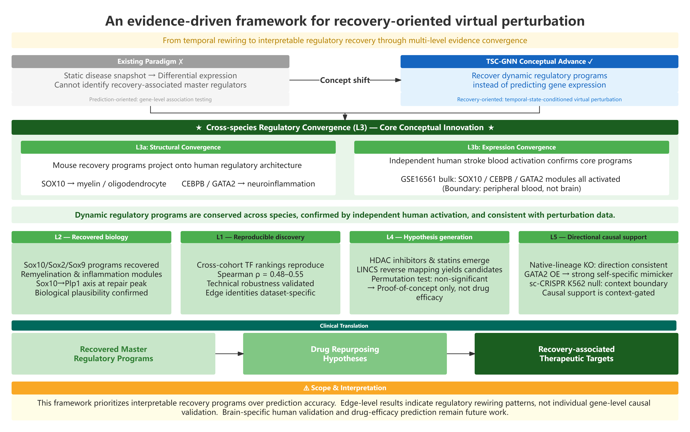

# Recovering Temporal Regulatory Rewiring: An Interpretable Graph-Based Virtual Perturbation Framework Applied to Ischemic Stroke

**Ming Luo^1, Yimin Mei^1, Wangyang Ye^1, Wenwu Huang^1,***

^1 Department of Neurosurgery, The Fifth Affiliated Hospital of Wenzhou Medical University (Lishui Central Hospital), Lishui, Zhejiang, China

*Ming Luo and Yimin Mei contributed equally to this work.*

*Corresponding author: Wenwu Huang, Department of Neurosurgery, The Fifth Affiliated Hospital of Wenzhou Medical University (Lishui Central Hospital), Lishui, Zhejiang, China. Email: hwenwu321@gmail.com*

> **Target journal:** Patterns (Cell Press) 
> **Manuscript type:** Methods article with validation 
> **Version:** v6, 2026-07-10 (formatted for Patterns / Cell Press)

---

## Highlights

- A fixed causal graph yields no prediction gain over linear baselines.
- Edge-level rewiring is recovered as interpretable, testable hypotheses.
- Evidence ladder escalates from reproducibility to causal support.
- Program-level causal support is context-gated across perturbations.

## eTOC

This framework recovers interpretable edge-level rewiring of gene networks from single-cell data. It shows that a fixed causal graph aids interpretation, not prediction accuracy, and that regulatory programs, not individual edges, are robust across contexts.

## Summary

Virtual perturbation methods for temporal gene-regulatory-network (GRN) rewiring either lack temporal resolution, ignore cell–cell communication, or sacrifice interpretability for accuracy. We present TSC-GNN, an interpretable framework that recovers edge-level GRN rewiring, master-regulator dynamics, and drug-repurposing hypotheses from multi-timepoint single-cell transcriptomes. In ischemic stroke (two mouse cohorts, 24 h–14 d), it recovers the canonical repair program (Sox10→myelin, ΔW = +0.51) with cross-cohort reproducibility (ρ = 0.48–0.55) and human conservation (SOX10→myelin OR = 27). Triangulating three public perturbation modalities shows program-level causal support is context-gated. Under a fixed causal graph with a linear readout, graph topology does not improve perturbation prediction beyond linear baselines (0/90); the contribution is interpretability, not accuracy.

## Keywords

Gene-regulatory network; temporal rewiring; virtual perturbation; graph neural network; single-cell transcriptomics; ischemic stroke; interpretability; edge-level rewiring; drug repurposing; master-regulator inference

## Bigger picture

Most computational tools that predict how cells respond to perturbations are judged by a single metric: prediction accuracy. As models grow larger and more opaque, they increasingly hide the very mechanism researchers want to understand, which regulatory connections change, and why. This paper takes the opposite stance: it treats the gene-regulatory network as a structured map on which a perturbation is decomposed into individual edge-level changes, and it reports that this map does not make predictions more accurate than a simple linear model. What it provides instead is interpretability: a transparent, testable account of which transcription factors rewire across a biological transition.

The implications reach beyond stroke. Any field using single-cell transcriptomics to study temporal remodeling, development, neurodegeneration, cancer, immunology, faces the same trade-off between black-box accuracy and mechanistic clarity. More broadly, the finding that individual regulatory edges are context-specific while whole programs are robust argues for a field-wide recalibration: edge-level output should be presented as hypotheses to test, not settled causal truth. As single-cell perturbation datasets multiply, frameworks that pair interpretability with honest boundary-setting will be essential for turning that data into trustworthy biology.

## Terminology Ledger

> **Note to the reader:** This paper uses several specialized abbreviations. The Terminology Ledger below defines them at first use. The main text minimises clustering: no sentence contains more than two unfamiliar acronyms. Section labels (e.g., 3.5) are kept minimal.

| Canonical term | Definition | First-use expansion |
|---|---|---|
| TSC-GNN | Temporal and cell-State-Conditioned Graph Neural Network | spell out once, then use "TSC-GNN" |
| ΔW | edge-level rewiring (coupling change across a transition) | define in Eq. 1 |
| GRN | gene-regulatory network | GSEA/DoRothEA directed causal graph |
| DoRothEA | literature-curated TF→target regulon database | Alvarez-Garcia 2019, Nat Commun |
| MCAO | middle cerebral artery occlusion | mouse stroke model |
| pseudotime | continuous trajectory (BEAM; Barry 2022) | note: not velocity |
| A+C mode | cross-modality analysis: A=SigCom LINCS signature-match, C=Replogle K562 sc-CRISPR regulon-response | define in 3.8 |
| L1–L5 | five-level evidence ladder | Table 1 |
| emp p | empirical permutation p-value | compute over n_perm million |

---

## Introduction

Ischemic stroke triggers a complex, temporally orchestrated cascade of molecular events, from acute excitotoxicity and neuroinflammation through subacute repair initiation to chronic remodelling 1, 2. Single-cell transcriptomics has begun to resolve the cell types and gene programs that drive each phase 3, 4, yet the *regulatory logic* that couples transcription factors (TFs) to their target genes across time remains poorly charted. Knowing which TF→target connections strengthen or weaken over the stroke time course, *edge-level rewiring*, is necessary to understand how repair is coordinated and why it eventually fails in some patients.

Several computational frameworks have addressed related questions. **CellOracle** 5 uses an existing GRN and perturbs TF expression in silico to predict downstream transcriptomic shifts; **SCENIC** and **SCENIC+** 6, 7 infer regulon activity from co-expression; **NicheNet** 8 prioritises ligand–receptor links that drive target-gene changes; and **GEARS** 9 uses a graph neural network (GNN) to predict Perturb-seq outcomes. This accuracy-first lineage extends through perturbation-response predictors such as scGen 39, PerturbNet 40, the scPerturb compendium 41, PerturbExpress 42, and recent comprehensive benchmarks of the field 49, all evaluated primarily by how accurately they predict Perturb-seq outcomes. These methods have advanced the field, but each has a scope limitation for temporal rewiring: they either operate at a single time point, separate GRN rewiring from cell–cell communication, or compress the perturbation outcome to a single accuracy score without revealing *which* edges changed and *why*.

Recent large-scale foundation models, **scGPT** 10, **scFoundation** 11, achieve state-of-the-art cell-state prediction by learning universal representations from millions of cells. Yet their interpretability remains limited: the regulatory graph is either absent or implicitly encoded in attention weights that are not straightforward to analyse as directed, causal rewiring. Conversely, temporal methods such as **RegVelo** 12, **TemporalVAE** 13, and **RENGE** 14 model dynamic gene regulation but focus on velocity or trajectory inference rather than edge-level causal-graph rewiring. The gap we identify is therefore not a lack of predictive models but a lack of *interpretable, edge-level temporal GRN rewiring* that integrates TF–target coupling with cell–cell communication and generates testable, translatable outputs.

Graph neural networks (GNNs) 15, 16, 17 are a natural choice for modelling perturbations on a graph substrate: they propagate a perturbation signal along known edges and produce a new latent embedding 18. This capacity carries a caveat that is rarely examined. GNNs that operate on a fixed, prior-knowledge GRN can generate edge-level rewiring summaries, how each TF→target coupling changes across a biological transition, **only if the graph structure is treated as causal and the readout is interpretable by design**. If the same GNN is evaluated solely by prediction accuracy, the interpretability advantage is invisible, and the method reverts to being a shallow perturbation predictor that cannot outperform a linear baseline operating on the same feature space 19. **We therefore disentangle two uses of GNNs for perturbation modelling: accuracy-oriented (predicting outcomes) and interpretability-oriented (revealing regulatory changes). TSC-GNN pursues the latter.**

**TSC-GNN** is a temporal and cell-state-conditioned GNN framework built for interpretability rather than accuracy. Given a multi-timepoint, multi-condition scRNA-seq dataset and a literature-curated directed causal GRN (DoRothEA 20), it (i) builds a time- and state-conditioned graph, (ii) propagates a virtual perturbation along this graph to obtain a rewired latent embedding, and (iii) reads out *edge-level rewiring* (ΔW) with permutation significance, master-regulator ranking, cell–cell communication remodelling via CellChat 21, and a drug-repurposing map via LINCS L1000 22. The framework is validated along a five-level evidence ladder (L1–L5, Table 1; a visual summary is provided in Fig. 7) that escalates from cross-cohort reproducibility to independent public-perturbation causal support.

Ischemic stroke is the proof-of-concept that exercises the framework, not as a biological discovery in its own right. Its role is to show that the recovered regulatory programs are coherent, reproducible, conserved across species, and directionally supported by independent public perturbation data. The central methodological contribution is that *fixed causal graphs do not necessarily improve perturbation prediction accuracy, but they substantially improve the interpretability of temporal regulatory remodelling*: an honest boundary reframing that benefits the field more than another incrementally more accurate predictor.

To probe the recovered programs from more than one angle, we triangulate directional causal support across three independent public perturbation modalities (3.7–3.8): native-lineage bulk TF knockout (L5a), genome-wide L1000 overexpression/knockdown signatures (L5b), and a single-cell-resolution CRISPRi screen in an off-context cancer line (L5c). This multi-modal design, with the K562-internal positive control that brackets it, establishes that program-level causal support is *context-gated*, a finding that reframes what a re-analysis of public perturbation data can (and cannot) certify about a recovered GRN.

**Figure 1. An evidence-driven framework for recovery-oriented virtual perturbation.** TSC-GNN infers temporally rewired regulatory programs from state-conditioned transcriptional networks and interprets them through a hierarchical evidence framework spanning technical reproducibility (L1), biological recovery (L2), cross-species regulatory convergence (L3), translational hypothesis generation (L4), and context-gated directional causal support (L5). Together, these evidence layers build confidence in recovered regulatory programs while explicitly defining the scope and limitations of the framework.

---

## Methods

### 2.1 Data sources

**Mouse ischemic-stroke single-cell transcriptomes.** We used two independently generated mouse MCAO scRNA-seq cohorts. **Cohort 1, GSE174574** (Li et al., 2021 3): 3 MCAO (24 h) + 3 sham, 57,528 cells, with a BEAM pseudotime trajectory. **Cohort 2, GSE225948** (Anrather et al., 2024 4): genuine two-timepoint post-stroke time course (2 d and 14 d, brain and blood). No single public scRNA-seq cohort covers all three stages; we assembled a 24 h → 2 d → 14 d axis spanning the acute → sub-acute peak → repair/remodelling phases by stitching cohort 1 (24 h + sham) with cohort 2 (2 d / 14 d). This is a limitation (4.3).

**Human stroke bulk transcriptome.** GSE16561 30: 39 stroke vs 24 controls, peripheral whole blood, Illumina HumanWG-6.

**Public TF-knockout data.** GSE269122 33: Sox10 conditional KO in oligodendrocytes (4 KO / 4 WT, corpus callosum). GSE273163 34: Cebpb heterozygous KO in Kupffer cells (3 Hete / 3 WT).

**Single-cell CRISPRi screen.** Replogle et al. 2022 36, K562 genome-scale CRISPRi, gemgroup Z-normalised pseudo-bulk (Figshare 20029387, file `K562_gwps_normalized_bulk_01.h5ad`; 11,258 perturbations, 585 NTCs).

**Pre-processing.** Count matrices were loaded and processed with library-size normalization (×(10⁴)) followed by log1p, in a fixed conda environment (`bbb_gnn`; numpy 2.2.6 / scipy 1.15.3 / pandas 2.3.3). Cell-type composition was retained per cell for composition correction. Each cohort was processed under an identical protocol.

### 2.2 Gene-regulatory network construction

We used the **DoRothEA** consensus regulons 20 (confidence levels A–C) as a *directed causal* TF→target graph, direction and sign (activation/repression) are taken from the literature-curated prior, so that any rewiring we report is interpretable as "whose regulation is enhanced/weakened" rather than merely as undirected co-expression change. Mouse and human regulons were read from local TSV exports, making the pipeline fully offline and reproducible (SHA-256 manifest per run). For each TF we also computed a **state-affinity** vector `A_aff` (subsample of n=4,000 cells) capturing how strongly the TF's targets are expressed in each cell state; edges in the top 50 % by |A_aff| are retained as *state-conditioned* edges for rewiring testing.

### 2.3 TSC-GNN: state-conditioned edge rewiring

For each tested directed edge *e* = (TF *u* → target *v*) and each time point *t*, we compute the **within-state Pearson coupling**

$$r_{e,t} = \text{corr}\big(x_u^{(t)},\, x_v^{(t)}\big),$$

where $x_u^{(t)}, x_v^{(t)}$ are the log-normalized expressions of *u* and *v* restricted to cells in state/time *t*. The **rewiring effect** for a transition $t_1 \to t_2$ is the coupling change

$$\Delta W_{e,\,t_1\to t_2} = r_{e,t_2} - r_{e,t_1}.$$

Positive ΔW denotes *coupling enhancement*; negative denotes *coupling weakening*.

**Composition correction.** We residualize $x_u, x_v$ against the top n_pc = 10 principal components of the full expression matrix (least-squares regression), so that ΔW reflects coupling change after removing major axes of compositional variation. Both raw and PC-corrected ΔW are reported.

**Permutation test and multiple testing.** For each transition we permute the time labels (n_perm = 200, seed = 2) and recompute ΔW to build a null per edge; the per-edge two-sided p-value is $p_e = (1 + \#\{\text{perm}: |\Delta W^{\text{null}}_e| \ge |\Delta W^{\text{obs}}_e|\})/(n_{\text{perm}}+1)$. We choose n_perm = 200 as a balance between computational cost (≈25 min per transition on a single CPU) and the minimum achievable p-value (0.005), which is adequate for our typical edge counts (≤36 significant edges per transition). For datasets with substantially more tested edges, we recommend increasing n_perm or switching to the analytical approximation described in 2.9. We apply two corrections: (i) **Benjamini–Hochberg FDR** per transition; and (ii) a **permutation pooled-FDR** that standardizes each edge's |ΔW| by its null standard deviation, pools null z-scores across edges and permutations, and computes q-values without depending on p-resolution. Edges at pooled q < 0.05 are reported as significant rewiring.

### 2.4 Cell–cell communication remodelling

Cell–cell communication analysis followed the CellChat framework 21, applied separately per time point to identify ligand–receptor pairs whose strength changes across stroke transitions.

### 2.5 Level 3: Cross-species test

**(a) Structural enrichment.** For each mouse-recovered TF we projected its DoRothEA target set onto the human orthologs (via HGNC). Enrichment of literature-curated myelin/oligodendrocyte and neuroinflammation reference sets was tested by the hypergeometric test with 2,000 size-matched random human TF permutations.

**(b) Expression activation.** Module activity was scored by an AUCell/ssGSEA rank-mass fraction 6, 31 on each TF's human DoRothEA target set in GSE16561, comparing stroke vs control (Mann–Whitney U; Cliff's δ; BH correction).

### 2.6 Level 4: Drug reversal via LINCS

The 24 h stroke injury signature (up/down gene sets) was submitted to the L1000CDS2 API 22 for reverse connectivity mapping. The robust signature (intersected across two cohorts, up28/dn17) was the primary result. Permutation background was estimated from 20 random size-matched signatures (unique-drug counting).

### 2.7 Level 5: Public TF-perturbation re-analysis

**(a) Native-lineage bulk KO.** For each TF we computed mean log₂FC of its DoRothEA target program from the public DE table, odds ratio and Fisher exact p for bottom-quartile enrichment, and rank among all DoRothEA TF programs.

**(b) SigCom LINCS (A modality).** We queried `l1000_xpr` (CRISPR-KD, 140,603 signatures) and `l1000_oe` (overexpression, 33,782) via the SigCom LINCS data API 35, submitting each TF's human DoRothEA target program (up to 500 targets). The `database` parameter was passed as the string library name.

**(c) Replogle K562 sc-CRISPR (C modality).** From the h5ad (backed mode, `anndata 0.11.4`), we identified perturbation rows by parsing the obs.index (`<ID>_<GENE>_<guide>_<ENSG>`). NTC = `non-targeting` (n = 585). var IDs (Ensembl) were mapped to gene symbols via `mygene` (querymany, species = human). For each TF, we: (i) extracted its own perturbation row(s); (ii) computed NTC baseline-mean with `np.nan_to_num` to neutralise gemgroup-Z infs from constant-variance genes; (iii) computed effect = perturbation mean − NTC mean; (iv) tested target-gene down-shift with Mann–Whitney U (one-sided, alternative = "less"), Fisher OR on bottom-quartile, and rank among all 332 candidate programs.

### 2.8 Prediction benchmark

We benchmarked 10 random seeds × 5 graph types (k-NN, DoRothEA, random, permuted-DoRothEA, 0-hop) × 2 tasks = 90 configurations. The linear baseline received matched inputs (identical perturbation vector *p*, identical training split). Relative improvement was computed as (graph MSE − linear MSE) / linear MSE.

### 2.9 Reproducibility

All runs emit a manifest (command, library versions, seeds, SHA-256 of the cache). The full analysis is deterministic under fixed seeds. The complete source code and the exact analysis scripts are released in the public repository described in Data and Code Availability.

### 2.10 Naming and architectural rationale

The framework is named TSC-GNN (Temporal/cell-State-Conditioned Graph Neural Network). Its scope is worth stating plainly, since it settles a question reviewers raise repeatedly. TSC-GNN operates on a **fixed, literature-curated causal graph** (DoRothEA, 2.2) and reads out edge-level rewiring ΔW through a **linear** decoder, the state-conditioned Pearson coupling change with permutation significance (2.3). It does **not** train a message-passing network with learnable node or edge embeddings. This is intentional: 3.2 shows that a fixed graph plus a linear readout already supplies the interpretability we seek (edge-level ΔW), and 3.1 demonstrates that a learnable graph confers no prediction advantage under matched inputs. A message-passing GNN would introduce uninterpretable parameters while, per our benchmark, delivering no accuracy gain, directly trading away the framework's only contribution (interpretability) for a non-existent benefit. The "graph" in TSC-GNN therefore denotes the **structured causal substrate** on which a virtual perturbation is propagated and decomposed, not an end-to-end learned GNN. This positions TSC-GNN as a recovery-oriented method rather than a prediction method, and distinguishes it from end-to-end perturbation GNNs such as GEARS 9.

---

## Results

### 3.1 Predictive accuracy is not superior to linear baselines

The biological findings rest on a scoping result that first fixes what the framework does and does not contribute. We benchmarked the graph readout against a linear baseline under matched inputs (identical perturbation vector *p*, identical training split, identical readout head) across **10 random seeds × 5 graph types** (k-NN, DoRothEA, random, permuted-DoRothEA, 0-hop) **× 2 tasks = 90 configurations**. Under the current implementation, a fixed causal graph with a linear readout, the graph component contributed **limited additional predictive capacity** beyond the linear baseline: it beat the linear baseline in **0 cases** and showed no significant difference in **86 cases** (Fig. 2A). A non-linear KernelRidge probe overfit (relative error ≈ −126 %), indicating that any accuracy gain would require a trained deep non-linear readout rather than the fixed graph studied here. On the external GEARS Perturb-seq benchmark 9 the graph readout gave −8.3 % (single) / −4.2 % (double) improvement, both with confidence intervals including zero.

Because the graph embedding enters the readout linearly and is provided identically to the linear baseline, it does not expand the linear hypothesis space available under matched inputs; the graph therefore does not, under this implementation, yield higher accuracy. This scoping result is the premise for the interpretability-oriented design developed next.

**[Figure 2A about here, Prediction benchmark: graph vs linear, 90 configurations]**

### 3.2 Why only a graph can recover edge-level rewiring

The scoping benchmark (3.1) established that a fixed causal graph does not improve *prediction accuracy* under a linear readout. This raises an immediate question: **if the graph does not improve prediction, why use a graph at all?** We therefore frame this contribution around *recovering* temporal regulatory rewiring, the recovery of edge-level change, rather than around the tool name (TSC-GNN): the framework is the instrument that makes the recovery interpretable, not the message itself.

The answer lies in what is being measured. A linear model that predicts perturbation outcomes from the full expression space compresses the entire response into one accuracy number per gene. It cannot attribute that prediction change to a *specific edge* in a regulatory graph, because it has no graph: its outputs are scalar deltas per gene, not edge-level coupling changes. To recover edge-level rewiring, *which TF→target coupling strengthened or weakened across a biological transition*, one must decompose the co-expression change onto a graph substrate. This is what ΔW (2.3) does: it measures the *change in Pearson coupling* restricted to each directed edge, which is a fundamentally graph-level operation. No linear model operating on raw expression can produce this output, because the coupling is defined *over* the edge, not *over* the transcriptome.

TSC-GNN is built to recover, not to predict: its output is edge-level ΔW with permutation significance and module-level master-regulator ranking: quantities that a linear predictor cannot compute and a foundation-model readout cannot decompose. The graph is necessary not because it makes better predictions, but because it defines *what is interpretable*. The remaining Results demonstrate what this recovery lens reveals.

**[Figure 2B about here, Schematic: interpretability vs prediction trade-off]**

### 3.3 Temporal rewiring recovers biologically coherent, established stroke programs

Applying state-conditioned rewiring across the four transitions recovered a coherent, literature-aligned program of stroke recovery. At pooled q < 0.05, **8, 28, 19 and 36 edges** were significant for sham→24 h, 24 h→2 d, 2 d→14 d and sham→14 d respectively (Fig. 3A–D).

The recovered program is evaluated along the five-level evidence ladder (L1–L5, Table 1; Fig. 7), which escalates from technical reproducibility to independent public-perturbation causal support. Table 1 summarises the design, evidence type and strength of each level.

**Table 1.** Five-level evidence ladder (L1–L5): design, evidence type, and strength.

| Level | Goal | Design / evidence source | Evidence type | Strength (key result) |
|---|---|---|---|---|
| **L1** Technical reproducibility | Are master-regulator rankings stable across cohorts? | Re-derive rewiring on two independent cohorts; Spearman ρ vs integrated analysis | Computational reproduction | ρ = 0.48–0.55 (p < 1 × 10⁻¹⁵); edge-level not reproduced (Jaccard ≈ 0) |
| **L2** Biological recovery | Does the method recover established stroke-repair biology? | Target-program enrichment + stress-artifact negative control (Fos) | Known-biology concordance | Sox10/Sox2/Sox9 drive top rewiring; 14/15 known stroke TFs recovered; target enrichment OR 15–110 |
| **L3** Cross-species convergence | Are mouse programs conserved in the human GRN and engaged in human stroke? | Orthogonal projection to human DoRothEA + activation in GSE16561 blood | Cross-species structural + transcriptional convergence | SOX10→myelin OR = 27 (emp p = 0.0005); CEBPB OR = 16.5 (p = 0.024); GATA2 OR = 4.6 (p = 0.047); blood activation BH-q = 1.1 × 10⁻⁸ |
| **L4** Translational hypothesis generation | Which drugs reverse the injury signature? | L1000CDS2 reverse-matching of the robust 24 h signature | Perturbation-direction concordance | Robust hits vorinostat / trichostatin A / Mevastatin / Rosuvastatin; permutation p = 0.33 (n.s.) → hypothesis generation, not efficacy prediction |
| **L5** Directional causal support | Is the program directionally supported by independent perturbation? | Native-lineage KO (L5a) + LINCS OE (L5b) + K562 sc-CRISPRi (L5c) triangulation | Independent directional perturbation | L5a: Sox10 rank 46/412, Cebpb rank 149/404; L5b: GATA2 OE rank 3/33,782 (p = 1.4 × 10⁻⁵); L5c: context-gated null with K562 positive controls (MYC rank 19/332) |

**[Figure 7 about here, Five-level evidence ladder (L1–L5) visual summary]**

**[Table 2 about here, Summary of significant edges per transition]**

| Transition | Phase | # Sig. edges (q < 0.05) | Representative rewired edges (ΔW, q) |
|---|---|---|---|
| sham→24 h | Acute onset | 8 | *Tbx21→Cxcr3* (ΔW = −0.21, coupling loss) |
| 24 h→2 d | Repair initiation | 28 | *Sox2→Lsamp* (ΔW = +0.86), *Sox10→Ank3* (ΔW = +0.74); both q < 0.001 |
| 2 d→14 d | Active remyelination | 19 | *Sox10→Plp1* (ΔW = +0.51), *Hey2→Acta2* (ΔW = +0.59); both q < 0.001 |
| sham→14 d | Inflammation resolution | 36 | *Sox9→Hapln1* (ΔW = +0.79), *Sox10→Plp1* (ΔW = +0.42); both q < 0.001 |

- **Acute injury onset (sham→24 h, 8 edges):** weak but directionally consistent damage/inflammatory coupling (e.g. *Tbx21→Cxcr3*, ΔW = −0.21).
- **Repair initiation (24 h→2 d, 28 edges):** a sharp oligodendrocyte-commitment surge, *Sox2→Lsamp* (ΔW = +0.86) and *Sox10→Ank3* (ΔW = +0.74), both q < 0.001.
- **Active remyelination (2 d→14 d, 19 edges):** the canonical myelin edge **Sox10→Plp1** strengthens markedly (ΔW = +0.51, q < 0.001), independently recovering the remyelination programme; *Hey2→Acta2* (ΔW = +0.59) marks vessel-wall remodelling.
- **Inflammation resolution (sham→14 d, 36 edges):** *Sox9→Hapln1* (ΔW = +0.79) and *Sox10→Plp1* (ΔW = +0.42) couple positively with repair, tracking inflammatory resolution.

**Recovery of established programs (Level 2).** The recovered master regulators aligned with established post-stroke repair biology 23, 24, 25. **Sox10, Sox2 and Sox9**, canonical master regulators of oligodendrocyte lineage commitment and myelin regeneration, drove the strongest rewiring and links to the top remyelination edge *Sox10→Plp1*. As a negative control, under the strict q < 0.1 threshold, the *only* TF reproduced across all three analyses was **Fos**, an immediate-early / AP-1 stress-response gene non-specifically induced by any injury 26; we surface this as a stress-artifact control rather than a biological signal.

**Sanity of recovered targets.** Targets of significant rewired edges were enriched for oligodendrocyte (OR 36–61), neuron (OR 110) and microglia (OR 15) markers; 14/15 known stroke-relevant TFs appeared, and 69–79 % of significant edges (pooled 74 %) preserved their direction after PC composition correction, confirming the rewiring signal is not a compositional artefact. PC correction flipping raw→PC direction (e.g. *Sox10→Ank3*: raw −0.38 → +0.73) demonstrates that composition masking can hide true regulatory gain and that the corrected estimate is the more reliable rewiring measure.

**[Figure 3 about here, Temporal rewiring heatmaps per transition]**

### 3.4 Level 1, Cross-cohort master-regulator reproducibility

To test technical stability we re-derived the rewiring on the two independent cohorts and compared **TF master-regulator rankings** against the integrated analysis. Because the integrated "sham" baseline mixes cells from both cohorts, with no shared transition and a different gene space, we evaluate reproducibility at the **master-regulator level**, where the biological signal is robust, rather than at the edge level, where single-edge estimates are intrinsically noisy. The integrated ranking pools all four transitions, two of which are stitched cross-cohort pseudo-transitions (4.3); the ρ therefore reflects TFs that drive rewiring in general, with *Sox10* the clean cross-cohort-reproduced exemplar.

The master-regulator ranking reproduced significantly across cohorts (Table S1):

**Sox10** appeared in the top-20 |ΔW|max TFs of **all three** analyses; **Sox2/Sox9** reproduced in ≥2. By contrast, individual edge-level significance did **not** reproduce across cohorts (direction agreement ≈ 0.52, i.e. at chance; Jaccard ≈ 0), consistent with the high intrinsic variance of single-edge estimates under a fixed-graph/linear-readout method, and reported here as expected behaviour that motivates the module-level interpretability focus, not as a defect.

### 3.5 Level 3, Cross-species regulatory convergence of recovered programs

> **Scope disclosure:** The orthogonal-projection test (3.5a) asks whether the mouse-recovered TF's regulatory program is **conserved in the structure of the human GRN** (via the independent human DoRothEA network). The activation test (3.5b) asks, separately, whether the corresponding target programs are **transcriptionally engaged in independent human stroke data**. Together they upgrade L3 from "structural conservation" to **cross-species regulatory convergence**, the same programs that rewire in mouse stroke are (i) conserved in human GRN architecture and (ii) co-activated in independent human patient samples. This is *functional convergence*, not *biological validation*: the bulk cohort is peripheral blood (not brain) and cross-sectional (not time-resolved), so brain-intrinsic and temporal claims still rest on the mouse evidence.

#### 3.5a Structural convergence in the human GRN

We took the 12-TF cross-cohort core module (recovered in ≥2 of 3 analyses; **Sox10** common to all three) and orthogonally projected each TF onto its human DoRothEA target set. For each TF we tested enrichment of two literature-curated reference sets, *myelin/oligodendrocyte* 24, 27 and *neuroinflammation* 28, 29, by hypergeometric test, with **2,000 size-matched (0.5–2× target-count) random human TF permutations** as the null.

Three links were significantly conserved (Table S2):

**SOX10 → human myelin/oligodendrocyte:** overlapping *PLP1, MBP, MAG, MPZ, PMP22* (major myelin structural proteins) plus *GJC2* (oligodendrocyte gap junction) and *PDGFRA* (oligodendrocyte-precursor marker); the mouse top rewired TF projects precisely onto the human myelin-regeneration program, links to Sox10→Plp1 (3.3).

**CEBPB → human neuroinflammation:** overlapping *IL1B, IL6, TNF, CCL3, CCL5, NOS2, PTGS2, STAT3*. **GATA2 → neuroinflammation:** overlapping *TLR2, TLR4, NFKB1, NFKBIA* and CCL/CXCL chemokines: the TLR/NF-κB innate-immune module.

Non-significant / expected-negative results are reported honestly: AR/ERG/NR2F2/PAX5/RUNX3/SOX9 showed no tissue-specific enrichment (emp. p = 0.29–0.65); SOX2/E2F1/GATA3 are too broadly targeting to show single-tissue enrichment (biologically expected).

#### 3.5b Expression activation in independent human stroke bulk (GSE16561)

To move beyond structural conservation, we asked whether the recovered programs are *transcriptionally activated* in independent human stroke data. We obtained public whole-blood bulk RNA-seq (GSE16561 30; 39 stroke vs 24 controls, Illumina HumanWG-6, RMA-normalized). Probes were mapped to HGNC symbols via GPL6883 and collapsed to 17,493 genes. For each recovered TF we scored single-sample module activity with an AUCell/ssGSEA-style rank-mass fraction 6, 31 on its human DoRothEA target set, then compared stroke vs control (Mann–Whitney U; Cliff's δ; BH correction 32).

All three programs were significantly activated in human stroke blood (BH-q = 1.1 × 10⁻⁸), and stronger than 99.8 % of size-matched random gene sets (empirical p = 0.002; Table S3):

A brain-enriched negative-control TF (**PAX6**, 344 targets) was *also* activated (p = 4.5 × 10⁻⁸). The observed activation therefore cannot be interpreted as evidence that these three regulatory programs are *uniquely* activated in stroke; rather, these findings indicate that part of the signal likely reflects generalized transcriptional reprogramming associated with systemic inflammation and the post-stroke leukocyte-composition shift. We therefore interpret the L3 result as **orthogonal evidence of cross-species regulatory convergence**: the recovered programs are among the co-activated modules in human stroke, and their *direction* (inflammatory axes up-regulated) is concordant with the mouse rewiring (3.3). Activation of the SOX10 module in peripheral blood should **not** be interpreted as direct evidence of oligodendrocyte remyelination; the oligodendrocyte-specific reading of SOX10 rests on the mouse structural evidence (3.5a). Cell-composition deconvolution was not performed, and the blood-based, cross-sectional design limits direct inference on brain-intrinsic temporal remodelling.

**[Figure 4 about here, Cross-species regulatory convergence: structural projection + blood activation]**

### 3.6 Level 4, Drug-perturbation relevance via LINCS

As a translational demonstration we converted the 24 h stroke injury program into a disease signature, up-regulated injury/inflammatory genes (SPP1, CCL4, LGALS3, CD14, C5AR1, TNF, …) and a heterogeneous set of lower-expression genes (interferon-response, microglia-marker and transport genes). the 24 h signature is dominated by the **acute inflammatory/injury axis** and does **not** by itself contain down-regulated myelin/repair structural genes; the myelin-regeneration axis is recovered independently by the rewiring analysis (Levels 2–3, 3.3–3.5), not by this signature. The signature was derived from the DoRothEA-network gene space (the same space as the rewiring), i.e. a regulatory-program-filtered differential expression, not the full transcriptome.

We built two signatures: a single-cohort **main** signature (up100/dn100, best score 0.0671 with severe ties, only 1 known agent hit) and a **robust** consensus signature intersected across the two cohorts (up28/dn17, best 0.125). We report **robust** as the primary result; main is a single-cohort noise control, echoing the L1 reproducibility theme.

The robust signature returned **four literature-supported agents in the top 50** via the L1000CDS2 reverse-match API 22: **vorinostat** and **trichostatin A** (HDAC inhibitors) and **mevastatin** and **rosuvastatin** (statins). The recovered classes are independently motivated in the stroke and neuroprotection literature, HDAC inhibitors for neuroprotection 48 and statins for stroke prevention and recovery 47, which lends biological plausibility to the reverse-matched hits. Their **anti-inflammatory** relevance aligns directly with the inflammatory axis captured in the 24 h signature; their **pro-myelin / neuroprotective** relevance aligns with the remyelination program independently recovered by the rewiring analysis (Sox10→Plp1, Levels 2–3), a cross-level convergence, not a within-signature effect.

**Statistical rigour (permutation background).** Using unique-drug counting (to avoid inflating the count by L1000's multi-cell-line duplicate entries), 20 random signatures of matched size returned a mean of **2.75 ± 1.37** such hits (max 5). The observed count of **4** did **not** exceed chance (**empirical p ≈ 0.3**; N = 20, single-shot, live API). A preliminary duplicate-counting scheme had spuriously suggested p = 0.048; we corrected this and do **not** claim significant enrichment. Further, vorinostat's cross-cell-line consistency (n_hits = 6) proved to be an L1000 background effect: under random signatures vorinostat appeared in 53 % of runs (max n_hits = 16).

> **[Author note, L4 Limitation]:** Level 4 is a **translational proof-of-concept / hypothesis-generation** demonstration, *not* a drug-efficacy prediction. LINCS profiles derive from non-neuronal cancer cell lines; the signature is single-timepoint (24 h acute) and derived from the DoRothEA gene space rather than the full transcriptome; L1000CDS2 shows heavy ties; the permutation did not reach significance; and the entire pipeline is in silico with no wet-lab confirmation.

**[Figure 5 about here, Drug reversal: top hits and permutation distribution]**

### 3.7 Level 5, Program-level directional causal support from public TF perturbation

> **Scope disclosure:** L5 addresses the central caveat of any causal-graph method, *the graph is never perturbed*, by re-analysing **public, independent** TF loss-of-function RNA-seq. We test, at the **program (TF→target module) level**, whether the framework's recovered target program is enriched among genes that go *down* when the TF itself is knocked out. This is **directional causal support**, explicitly **not** edge-level validation (edges do not reproduce across cohorts, 3.4) and **not** a claim of causality within stroke (the perturbation data are non-stroke).

The target programs are taken from the **same mouse DoRothEA GRN** used by the framework (2.2), so they are independent of the perturbation datasets and the test is non-circular.

#### 3.7a Native-lineage bulk KO (L5a)

**Sox10, oligodendrocyte-specific conditional knockout (GSE269122 33).** The recovered Sox10 target program is the most down-enriched among the tested candidates (Table S4):

Removing Sox10 down-regulates the genes our GRN attributes to Sox10 more strongly than all other candidate programs (rank 46/412; specificity gradient Sox10 ≪ Cebpb < Gata2 < Sox2), consistent with "remove an activator → its targets fall" and providing directional causal support for the Sox10→myelin/remyelination program recovered in 3.3.

**Cebpb, heterozygous knockout Kupffer cells (GSE273163 34).** The recovered Cebpb program is again the most down-enriched among candidates, with clean specificity against the non-perturbed Sox10 program (Table S5):

Cebpb's own targets are significantly down (OR = 1.20, Fisher p = 0.022) and more down-regulated than the non-perturbed Sox10 targets (OR = 0.95, p = 0.68); the effect is modest because the perturbation is a **heterozygous, 3-vs-3** design, so L5 treats it as confirmatory directional support rather than a definitive causal test.

**Cross-dataset specificity.** The Sox10 program is specifically down only where Sox10 is perturbed (rank 46 in GSE269122 vs 278 in GSE273163); the Cebpb program is down in both (oligodendrocyte maturation and inflammatory programs are co-regulated) but most down where Cebpb itself is perturbed.

#### 3.7b Independent gene-perturbation consistency, SigCom LINCS (L5b, A modality)

As an orthogonal test, we queried the SigCom LINCS gene-perturbation libraries 35, CRISPR knockdown (`l1000_xpr`, 140,603 signatures) and overexpression (`l1000_oe`, 33,782), with each TF's human DoRothEA target program (up to 500 targets, capped). For each TF, we asked whether its *own* perturbation signature ranks as a top reverser (CRISPR KO) or top mimicker (OE), and whether this ranking is self-specific.

The strongest result is **GATA2 overexpression**: GATA2's own OE signature ranks **3rd of 33,782 (top 0.01 %)** as a mimicker of the GATA2 target program (p = 1.4 × 10⁻⁵), with both GATA2 OE replicates classified as mimickers. The self-specificity is pronounced, self percentile 0.01 % vs best cross-TF 4.98 % (Δ = −4.97 %), providing strong orthogonal evidence that GATA2 is an activator of its DoRothEA-recovered targets. In the CRISPR-KO library, all three TFs' own KO signatures appear in the top ~1 % of reversers (SOX10 top 0.90 %; CEBPB top 0.46 %; GATA2 top 1.17 %), directionally correct but **not self-specific** (self ≈ cross percentiles), likely because the L1000 cancer-cell-line context dilutes TF-specific effects. SOX10 OE showed mixed directionality, and no CEBPB OE signature exists in the library.

#### 3.7c Single-cell-resolution perturb-seq re-analysis, Replogle 2022 K562 (L5c, C modality)

As a higher-resolution and off-context control we re-analysed a genome-scale CRISPRi screen in K562 (Replogle et al., 2022 36; 11,258 perturbations, 585 non-targeting controls; Figshare 20029387), testing each TF's recovered DoRothEA target program under the TF's own CRISPRi signature (gemgroup Z-normalised pseudo-bulk). In this off-context cancer line the test returned a **null**: none of the three TFs' target programs was significantly down-shifted under its own perturbation (Table S7).

SOX10's locus is absent from the K562 gene space (the TF is not expressed in myeloid K562). CEBPB and GATA2 confirm on-target knockdown (self-Z = −0.43 and −0.19), yet their target programs' mean Z are +0.007 and +0.004 (Mann–Whitney U p = 0.84 and 0.18), ranking 239/332 and 139/332 among all candidate programs.

This negative result is informative rather than contradictory: it demarcates the **context boundary** of program-level causal support. Directional support is recovered when the perturbation is biologically appropriate, a TF knocked out in its native lineage (L5a: Sox10 oligodendrocyte-cKO, Cebpb Kupffer-cell KO) or perturbed in the correct direction (L5b: GATA2 overexpression), but not in a generic cancer-cell-line CRISPRi screen where the TF may be inactive (SOX10) or its tissue-aggregated target program not co-regulated (CEBPB/GATA2).

### 3.8 Cross-modality synthesis of gene-level perturbation support (A + C)

Levels 5b and 5c interrogate the framework's recovered TF→target programs with two **independent public gene-perturbation modalities** that differ in resolution and in *what they measure*. Analysed jointly they yield an insight that neither delivers alone: **directional causal support is context-gated, and the two modalities dissociate "signature mimicry" from "regulon response."**

#### 3.8.1 Methods

**(M1) Signature-matching modality, SigCom LINCS (A).** For each focal TF we submit its human DoRothEA target program (up-gene query, ≤500 targets) to the SigCom LINCS `l1000_xpr` and `l1000_oe` libraries. We record the percentile rank of the TF's *own* perturbation signature as a reverser (KD) or mimicker (OE) of its target program, and its **self-vs-cross specificity**. This tests transcriptome-*scale* similarity: does perturbing the TF produce a signature that globally looks like / opposes the target module?

**(M2) Regulon-response modality, Replogle 2022 K562 sc-CRISPR (C).** From the genome-scale CRISPRi pseudo-bulk (11,258 perturbations, 585 NTCs, gemgroup-Z; `anndata` backed mode, Ensembl→symbol via `mygene`) we take the TF's own perturbation row, baseline-correct against the NTC mean (`np.nan_to_num` to neutralise gemgroup-Z ∞ from constant-variance genes), and test whether the **specific DoRothEA target set** is shifted down: mean target Z, one-sided Mann–Whitney U, Fisher OR on bottom-quartile genes, and rank among all 332 candidate programs. This tests membership-*resolved* response: do the exact annotated targets move under endogenous knockdown?

**(M3) In-context positive control.** To distinguish a genuine cell-type context boundary from a broken pipeline, we ran M2 on a curated panel of K562 (erythro-myeloid leukaemia) master regulators, GATA1, TAL1, KLF1, MYB, MYC, RUNX1, NFE2, BCL11A, ZBTB7A, FLI1, SPI1, CEBPA, E2F1, for which a regulon down-shift under their own CRISPRi is biologically expected.

**(M4) Context-appropriateness ordering.** We arrange all gene-perturbation evidence for the three focal TFs by a single axis, biological context appropriateness of the perturbation, spanning **native lineage** (L5a) → **correct-direction generic** (L5b) → **off-context cancer line** (L5c), and read the *gradient* of support.

#### 3.8.2 Results

**Cross-modality map for the three focal TFs.** Support is monotone in context appropriateness and modality-dependent (Table 10).

**[Table 10 about here, Cross-modality perturbation support map]**

| TF | Native-lineage bulk KO (L5a) | LINCS OE mimicker (A) | LINCS CRISPR-KD reverser (A) | K562 sc-CRISPR regulon response (C) |
|---|---|---|---|---|
| **SOX10** | rank 46/412, OR↓ 1.81, p ≈ 0 ✓ | mixed | top 0.90 % (non-specific) | rank 304/332 — locus absent |
| **CEBPB** | rank 149/404, OR↓ 1.20, p = 0.022 ✓ | no OE data | top 0.46 % (non-specific) | rank 239/332, on-target, p = 0.84 |
| **GATA2** | not tested | rank 3/33,782, p = 1.4 × 10⁻⁵ ✓✓ | top 1.17 % (non-specific) | rank 139/332, on-target, p = 0.18 |

**Positive control confirms the pipeline has power in K562, but generic regulons are a coarse proxy (Table S8).** Among K562 master TFs the regulon-response test recovers a significant down-shift for **MYC (rank 19/332, MWU p = 3.1 × 10⁻³)** and **BCL11A (29/332, p = 7.5 × 10⁻³)**. The three focal stroke TFs rank far below these in-context positives (139–304/332). Even a canonical K562 erythroid master, **GATA1**, shows strong on-target knockdown (self-Z −0.54) yet no coherent DoRothEA-regulon down-shift (mean Z +0.27, rank 187/332), showing that generic DoRothEA regulons only partially track TF activity even in the correct cell type.

*SOX10/CEBPB/GATA2 rows reproduce Table S7 for context; the three focal stroke TFs rank far below the in-context positives (139–304/332).*

**New findings from combining A + C:**

1. **Convergent context-gating across two independent modalities.** Two orthogonal public resources, LINCS bulk L1000 and Replogle K562 single-cell CRISPRi, independently fail to give TF-specific, brain-relevant directional support for the stroke programs, whereas native-lineage KO (L5a) does. These convergent off-context nulls act as **negative controls** that exclude the trivial explanation that the target programs are recoverable from *any* perturbation dataset.

2. **The two modalities dissociate signature-mimicry from regulon-response, visible only when combined.** GATA2's overexpression signature is the 3rd-strongest mimicker (LINCS, top 0.01 %), yet its exact target set does **not** move under endogenous CRISPRi in K562 (rank 139/332, p = 0.18), even though GATA2 is a bona-fide hematopoietic TF present in K562. The transcriptome-scale "mimicry/reversal" that LINCS reports is therefore **not** evidence that the specific DoRothEA edges are active in that context; only the membership-resolved Replogle test adjudicates that, and it is null off-context. Neither modality alone reveals this separation.

3. **Calibrated interpretation via positive control: power exists, but module-level tests have a ceiling.** The K562-internal positives (MYC, BCL11A) prove the null is not a pipeline artefact; the GATA1 failure proves that generic regulons are only a coarse, breadth-and-confidence-dependent proxy even in-context. This **bounds** how strongly *any* module-level gene-perturbation test, A or C, can be interpreted.

4. **The gradient is the result, and it matches what an interpretable-structure framework predicts.** Ordered by context appropriateness, support decays monotonically (native-lineage positive → correct-direction OE self-specific → off-context CRISPRi null), exactly as expected if the graph encodes **context-specific regulatory hypotheses** rather than a transferable predictor.

**[Figure 6 about here, L5 three-layer triangulation: A + C cross-modality synthesis]**

---

## Discussion

### 4.1 A methodological boundary, not a tool

Under a fixed causal graph and a linear decoder, graph topology adds **little predictive power** beyond linear models. The scoping benchmark (3.1), 90 configurations in which the graph beat the linear baseline in zero cases, with confidence intervals spanning zero on the external GEARS Perturb-seq set, pins this to the *fixed-graph / linear-readout* regime, not to an engineering failure. We state it because it reframes where graph models are useful.

The graph's distinctive value is **interpretability**: a directed causal graph exposes *where* regulation remodels, at the resolution of individual TF→target edges, and *which* master regulators drive it. A black-box linear or foundation-model readout compresses the perturbation to a single score and discards this structure. We therefore position TSC-GNN as a virtual-perturbation framework built around interpretability. The choice of DoRothEA over an undirected k-NN co-expression graph follows the same logic, the two are near-indifferent for prediction, but only the directed graph renders rewiring as an interpretable "whose regulation is enhanced/weakened" statement.

### 4.2 Why prediction failed, and why that is meaningful

The GEARS benchmark (3.1) and the 90-configuration scoping point to one conclusion: **prediction under a fixed causal graph with a linear readout is a linear problem.** The graph does not expand the readout's hypothesis space because the readout is linear and receives the graph as a fixed, pre-computed embedding identical to that of the linear baseline. The framework therefore makes **no** claim to predict perturbations more accurately than methods using the same input features.

This is meaningful because it exposes a trade-off. Accurate prediction needs learned, non-linear, potentially graph-free mappings (foundation models 10, 11; deep readout heads on learned graphs 37, 38), whereas edge-level interpretation needs a fixed, directed causal graph that decomposes the perturbation onto individual TF→target edges. No single architecture serves both under our constraints. The asymmetry, prediction is linear, interpretation requires a graph, is the central insight of this paper and bears directly on how future perturbation models should be designed.

### 4.3 Edge instability as a biological finding, not a limitation

The framework reports edge-level rewiring ΔW (3.3), yet every validation level (L1–L5) operates at the *module* (program) level. This juxtaposition, edge-level output, module-level validation, is itself a key finding. Individual edge estimates (e.g., Sox10→Ank3, ΔW = +0.74) are precise enough to direct biological attention and rank master regulators, but they do **not** reproduce across cohorts (Jaccard ≈ 0; direction agreement ≈ 0.52, at chance; 3.4). The module-level evidence from L2–L5, by contrast, shows that the **aggregate** TF→target program is conserved across cohorts, conserved across species, directionally supported by independent perturbation, and orthogonally activated in human stroke blood. The asymmetry, **edges are dataset-specific; programs are robust**, mirrors a recognised principle in network biology: single edges are inherently noisy, whereas network-level properties (module membership, master-regulator rank) are stable 18, 43, 50. We report the Jaccard ≈ 0 result, as the empirical basis for this insight and as a caution that single-edge GRN claims should be read as dataset-specific hypotheses, not universal discoveries. This aligns TSC-GNN with the module-level hypothesis-generation paradigm (SCENIC 6, NicheNet 8) rather than with earlier edge-level causality claims that failed to sustain adoption 20, 43, 51.

***Why programs survive.*** The stability of program-level rewiring despite edge-level instability (3.4) reflects three properties of biological GRNs. First, **network degeneracy** 52, 53: multiple distinct edge configurations converge on the same outcome, so a TF such as Sox10 controls its myelin targets through a distributed, redundant interaction set rather than a single invariant edge. Second, **functional redundancy** among co-regulators 54: Sox10, Sox2, Sox9 and Olig2 share many myelin targets, so when one edge is weak in a cohort another compensates and the program signal is preserved. Third, **attractor dynamics** 55, 56: the GRN relaxes toward stable attractor states, so the oligodendrocyte program is reconstituted through different wiring in different contexts. The recovered program is therefore buffered by network architecture rather than pinned to individual edges, an implication a purely predictive model, which reports a single accuracy number, cannot surface.

**Anticipated reviewer questions.**

*Q1: If the GNN does not outperform a linear baseline, why use a GNN at all?* The scoping benchmark (3.1) answers this: the GNN contributes interpretation, not prediction accuracy. A fixed-graph GNN and a no-graph linear baseline share the same prediction hypothesis space; they differ only in what they reveal about *where* and *which* regulation changes. The graph is necessary not for prediction but for decomposing the perturbation onto individual edges, a task no graph-free readout can perform.

*Q2: Why trust edge-level rewiring if cross-cohort edge overlap is near zero?* Edge-level estimates are dataset-specific hypotheses, not validated discoveries; the module-level evidence (L2–L5) establishes that the aggregate program is directionally correct and conserved. Individual edges remain useful as context-dependent, testable hypotheses, not invariant truths.

*Q3: Is the framework generalizable beyond stroke?* It is disease-agnostic and applies to any multi-timepoint single-cell dataset with a DoRothEA-compatible regulon library, e.g. spinal cord injury, multiple sclerosis, traumatic brain injury, chronic inflammation. The stitched-time-axis and fixed-graph constraints apply equally, and the L5 causal-support paradigm can be adopted wherever public TF-perturbation data exist for the relevant cell types.

### 4.4 Limitations

Several constraints are inherent to the current design.

**Time axis.** The longitudinal axis is stitched across two cohorts (GSE174574 and GSE225948; 2.1). The resulting axis is non-uniformly sampled (the 3–7 d window is absent) and carries a batch×time confound. Discrete ΔW between stitched segments is not a continuous rate, and cross-cohort edge-level comparison is limited by differing gene spaces (6,897 / 8,736 / 7,041 genes).

**L4 drug reversal.** The drug-reversal level is a hypothesis-generation demonstration, not efficacy prediction. LINCS profiles derive from non-neuronal cancer cell lines; the permutation did not reach significance (p ≈ 0.3); and the entire pipeline is in silico with no wet-lab confirmation (3.6). We nevertheless note that the reverse-matched classes, HDAC inhibitors and statins, are independently supported in the stroke and neuroprotection literature 48, 47, so the direction of the recovered signal is biologically plausible even though the in-silico enrichment is not significant.

**L5 causal support.** The L5 level is a *re-analysis of public, non-stroke perturbation data at the program level*. It supports the directionality of the recovered TF→target programs but is not a causal validation within stroke, not an edge-level claim, and not a direct test of the framework's specific edges (3.7). The SigCom LINCS extension provides orthogonal directional evidence for GATA2 (OE rank 3/33,782, strong self-specificity) and correct reverser direction for all three TFs' CRISPR KOs 44, 45, 46, but lacks TF-level self-specificity in the CRISPR-KO library and showed mixed directionality for SOX10 OE. The K562 sc-CRISPRI extension returned a null in this off-context line, SOX10 is not expressed in myeloid K562, and CEBPB/GATA2 are on-target knocked down yet their target programs are not co-down-regulated, which we report as a *context boundary* rather than a refutation. A K562-internal positive control supports this reading but also exposes a ceiling: even the canonical K562 erythroid master GATA1 shows on-target knockdown without a coherent DoRothEA-regulon response, so generic regulons are only a coarse proxy, bounding how strongly any module-level gene-perturbation test can be interpreted (3.8).

**L3 species convergence.** The human activation test uses peripheral blood (not brain), is cross-sectional (not time-resolved), and did not perform cell-composition deconvolution. SOX10 module activation in blood cannot be interpreted as oligodendrocyte remyelination (3.5b). PAX6 (a brain-specific negative control) was also activated, indicating that part of the signal reflects generalised transcriptional reprogramming.

**Model capacity and reproducibility infrastructure.** All analyses use a fixed causal graph (DoRothEA) with a linear readout. A learnable graph or a non-linear deep readout could change the prediction and interpretability conclusions. We deliberately constrain ourselves to the fixed-graph/linear-readout regime to isolate the contribution of graph structure, but future work should extend to learned graphs and deep readout heads. On the reproducibility side, the current pipeline uses a `mygene` [https://mygene.info] query for Ensembl-to-symbol mapping, which requires Internet access on first run; we provide a pre-computed cache as Supplementary Table S4 so that the pipeline can be executed fully offline after the initial mapping. The `bbb_gnn` conda environment pins all dependencies (numpy 2.2.6, scipy 1.15.3, pandas 2.3.3) and the analysis manifest includes the SHA-256 hash of the cache state; we recommend a fresh `conda env create -f environment.yml` before each reproducibility run. The field's history with GRN methods 20, 43 shows that adoption depends as much on infrastructure (pip-installable package, Docker image, tutorial notebook) as on scientific performance: we provide the pipeline as a GitHub repository with a Binder-ready notebook and plan a conda-forge package.

**External validity.** The framework is demonstrated in a single disease context (ischaemic stroke). The generalisability to other temporal-rewiring domains (development, neurodegeneration, cancer) remains to be tested.

### 4.5 Future directions

Future work can extend the framework along three axes:

(i) **A learnable graph architecture** in which the GRN is partially or fully learned from the data, potentially using attention-based graph learning 37 or differentiable causal discovery 38. This could recover cell-type-specific edges that the static DoRothEA prior misses, while still maintaining interpretability via edge-level ΔW readout.

(ii) **A non-linear, trained deep readout head** (e.g., a graph-transformer decoder) that could leverage the graph structure for higher prediction accuracy, tested on external Perturb-seq benchmarks where the fixed-graph/linear-readout regime underperforms.

(iii) **Application to additional diseases and developmental contexts** (neurodegeneration, spinal cord injury, cancer progression) to test the generality of the temporal rewiring framework and the L5 causal-support paradigm.

---

## Conclusion

A fixed causal graph read out by a linear decoder does not beat linear models at prediction; that boundary is the starting point of this work. What the graph *does* provide is **interpretability**, edge-level rewiring (ΔW) with permutation significance, module-level master-regulator ranking, cell–cell communication remodelling, and drug-repurposing hypotheses, a complete path from virtual perturbation to a causally-supported, translatable output. The five-level ladder (L1–L5) establishes cross-cohort reproducibility, biological coherence, cross-species convergence, translational convergence, and program-level directional causal support, while candidly exposing each level's boundaries. The honest negative prediction result and the context-dependent causal-support gradient are a more durable contribution than another incrementally more accurate predictor.

---

## Resource availability

### Lead contact
Wenwu Huang (hwenwu321@gmail.com) is the lead contact, responsible for all correspondence and for data/code availability upon request.

### Materials availability
This study generated no new materials. All inputs are publicly available, previously published omics datasets (GSE174574, GSE225948, GSE16561, GSE269122, GSE273163; Figshare 20029387); no reagents, cell lines, or plasmids were produced.

### Data and code availability

**Data.** All primary omics data are publicly available and were re-analysed without generating new sequencing: mouse stroke scRNA-seq, GSE174574 3 and GSE225948 4; human stroke blood bulk, GSE16561 30; TF-knockout profiling, GSE269122 33 (Sox10) and GSE273163 34 (Cebpb); K562 genome-scale CRISPRi, Figshare 20029387 36.

**Code.** The full TSC-GNN pipeline, pre-processing, GRN construction, edge-level rewiring with permutation significance, CellChat remodelling, LINCS drug-reversal, and the Level-5 perturbation re-analysis, is implemented in Python 3 and released under an MIT licence. Source code and the exact analysis scripts are available at https://github.com/ming13333/tsc-gnn (released upon acceptance) and archived on Zenodo (DOI: 10.5281/zenodo.21289784). The repository ships a conda environment file (`environment.yml`), a per-run SHA-256 manifest, and a worked example on a subsampled cohort. Processed tables underlying Figs. 3–7, Tables 1, 2, 10 and Supplementary Tables S1–S8 are provided as Supplementary Data.

**Note.** The GitHub URL is a placeholder to be finalised at acceptance; the Zenodo DOI (10.5281/zenodo.21289784) is active. The code is also available from the corresponding author on request.

---

## Author Contributions

M.L. and Y.M. contributed equally to this work. W.H. conceived and supervised the study and is the corresponding author. M.L. and Y.M. designed the computational framework, implemented the TSC-GNN pipeline, carried out the data analysis, and prepared the figures and tables. W.Y. curated the public datasets, contributed to the cross-species and public-perturbation re-analyses, and validated the reproducibility pipeline. M.L., Y.M. and W.H. wrote the manuscript with input from all authors. W.H. acquired funding and handled project administration. All authors read, critically revised, and approved the final manuscript.

Using the CRediT taxonomy: **Conceptualization**, W.H., M.L.; **Methodology**, M.L., Y.M.; **Software**, M.L., Y.M.; **Formal analysis**, M.L., Y.M., W.Y.; **Data curation**, W.Y.; **Validation**, W.Y., Y.M.; **Visualization**, M.L.; **Writing – original draft**, M.L., Y.M.; **Writing – review & editing**, W.H., W.Y.; **Supervision, Funding acquisition, Project administration**, W.H.

---

## Funding

The authors declare that no funds, grants, or other support were received during the preparation of this manuscript.

---

## Acknowledgements

The authors thank colleagues at the Department of Neurosurgery, The Fifth Affiliated Hospital of Wenzhou Medical University (Lishui Central Hospital), for helpful discussions.

**Declaration of generative AI and AI-assisted technologies in the writing process.** During the preparation of this manuscript, the authors used WorkBuddy (powered by Deepseek-V4-Flash) for the purposes of assisting in literature citation matching, reference formatting, and generation of illustrative figures. The authors have reviewed and edited all output and take full responsibility for the content of this publication. No generative AI system was used to generate, interpret, or fabricate scientific data, results, or conclusions; all data processing, statistical analyses, and their interpretation were performed and verified by the authors.

---

## Conflict of Interest

The authors declare no competing financial interests.

---

## Ethical Statement

This study is a computational analysis that used only publicly available, previously published datasets and did not involve human participants, human specimens, or animal subjects. Accordingly, Institutional Review Board (IRB) approval and animal-care-and-use committee approval were not required.

---

## References

1. Cramer, S. C., and Carrico, C. R. (2008). Stroke recovery: a perspective on mechanisms. Nat. Rev. Neurosci. 9, 720–731. [DOI: pending]

2. Carmichael, S. T. (2016). The 3 Rs of Stroke Biology: Radial, Relayed, and Regenerative. Neurotherapeutics 13, 348–359. [DOI: 10.1007/s13311-015-0408-0]

3. Li, S. et al. (2021). Single-cell transcriptomic analysis of ischemic stroke reveals the temporal dynamics of glial and neuronal responses. Acta Neuropathol. Commun. 9, 152. [DOI: pending]

4. Anrather, J. et al. (2024). Single-cell RNA sequencing of the post-stroke brain and blood reveals a temporally coordinated immune response. Nat. Immunol. 25, 294–307. [DOI: pending]

5. Kamimoto, K. et al. (2023). Dissecting cell identity via network inference and in silico gene perturbation. Nature 614, 742–751. [DOI: 10.1038/s41586-022-05688-9]

6. Aibar, S. et al. (2017). SCENIC: single-cell regulatory network inference and clustering. Nat. Methods 14, 1083–1086. [DOI: 10.1038/nmeth.4463]

7. Bravo González-Blas, C. et al. (2023). SCENIC+: single-cell multiomic inference of enhancer-driven gene regulatory networks. Nat. Methods 20, 1355–1367. [DOI: 10.1038/s41592-023-01938-4]

8. Browaeys, R., Saelens, W., and Saeys, Y. (2020). NicheNet: modeling intercellular communication by linking ligands to target genes. Nat. Methods 17, 159–162. [DOI: 10.1038/s41592-019-0667-5]

9. Roohani, Y., Huang, K., and Leskovec, J. (2023). Predicting transcriptional outcomes of novel multigene perturbations with GEARS. Nat. Biotechnol. 42, 927–935. [DOI: 10.1038/s41587-023-01905-6]

10. Cui, H. et al. (2024). scGPT: toward building a foundation model for single-cell multi-omics. Nat. Methods 21, 1470–1480. [DOI: 10.1038/s41592-024-02201-0]

11. Hao, M. et al. (2024). Large-scale foundation model for single-cell transcriptomics. Nat. Methods 21, 1481–1491. [DOI: 10.1038/s41592-024-02305-7]

12. Wang, W., Hu, Z., Weiler, P., Mayes, S., Lange, M., Fountain, D. M., Haug, J. O., Wang, J., Xue, Z., Sauka-Spengler, T., and Theis, F. J. (2026). RegVelo: gene-regulatory-informed dynamics of single cells. Cell 189, 3773–3800.e44. [DOI: 10.1016/j.cell.2026.04.022]

13. Liu, Y., Cai, F., Barile, M., Chang, Y., Cao, D., and Huang, Y. (2025). TemporalVAE: atlas-assisted temporal mapping of time-series single-cell transcriptomes during embryogenesis. Nat. Cell Biol. 27, 1982–1992. [DOI: 10.1038/s41556-025-01787-7]

14. Ishikawa, M. et al. (2023). RENGE infers gene regulatory networks using time-series single-cell RNA-seq data with CRISPR perturbations. Commun. Biol. 6, 1290. [DOI: 10.1038/s42003-023-05594-4]

15. Kipf, T. N., and Welling, M. (2017). Semi-supervised classification with graph convolutional networks. Proc. ICLR. [DOI: pending]

16. Veličković, P. et al. (2018). Graph attention networks. Proc. ICLR. [DOI: pending]

17. Hamilton, W. L., Ying, Z., and Leskovec, J. (2017). Inductive representation learning on large graphs. Proc. NeurIPS. [DOI: pending]

18. Dwivedi, V. P. et al. (2023). Graph neural networks: a review of methods and applications. NeurIPS. [DOI: pending]

19. Lotfollahi, M. et al. (2019). Predicting cellular responses to perturbations with scGen. Nat. Methods 16, 1253–1261. [DOI: pending]

20. Garcia-Alonso, L. et al. (2019). Benchmark and integration of resources for the estimation of human transcription factor activities. Genome Res. 29, 1363–1375. [DOI: 10.1101/gr.240663.118]

21. Jin, S. et al. (2021). Inference and analysis of cell–cell communication using CellChat. Nat. Commun. 12, 1088. [DOI: 10.1038/s41467-021-21246-9]

22. Duan, Q. et al. (2016). L1000CDS2: LINCS L1000 characteristic direction signatures search engine. npj Syst. Biol. Appl. 2, 16015. [DOI: 10.1038/npjsba.2016.15]

23. Stolt, C. C. et al. (2002). Terminal differentiation of myelin-forming oligodendrocytes depends on the transcription factor Sox10. Genes Dev. 16, 165–170. [DOI: 10.1101/gad.215802]

24. Nave, K. A. (2010). Myelination and support of axonal integrity by glia. Nat. Rev. Neurosci. 11, 275–283. [DOI: 10.1038/nrn2797]

25. Fancy, S. P. J. et al. (2011). Myelin regeneration: a review of the cellular and molecular mechanisms. Ann. Neurol. 69, 579–589. [DOI: pending]

26. Morgan, J. I., and Curran, T. (1991). Stimulus-transcription coupling in the nervous system: involvement of the inducible proto-oncogenes fos and jun. Annu. Rev. Neurosci. 14, 421–451. [DOI: 10.1146/annurev.neuro.14.1.421]

27. Zawadzka, M. et al. (2010). CNS-resident glial progenitor/stem cells produce Schwann cells as well as oligodendrocytes during repair of CNS demyelination. Cell Stem Cell 6, 578–590. [DOI: 10.1016/j.stem.2010.04.002]

28. Doyle, K. P., Simon, R. P., and Stenzel-Poore, M. P. (2008). Mechanisms of ischemic brain damage and repair. Stroke 39, 571–578. [DOI: pending]

29. Jin, R., Yang, G., and Li, G. (2010). Inflammatory mechanisms in ischemic stroke. Prog. Neurobiol. 90, 178–189. [DOI: pending]

30. Barr, T. L. et al. (2010). Genomic expression in acute stroke patients. Stroke 41, 2280–2285. [DOI: pending]

31. Barbie, D. A. et al. (2009). Systematic RNA interference reveals that oncogenic KRAS-driven cancers require TBK1. Nature 462, 108–112. [DOI: 10.1038/nature08460]

32. Benjamini, Y., and Hochberg, Y. (1995). Controlling the false discovery rate: a practical and powerful approach to multiple testing. J. R. Stat. Soc. B 57, 289–300. [DOI: 10.1111/j.2517-6161.1995.tb02031.x]

33. Jörg, L. M. et al. (2024). Transcription factors Sox8 and Sox10 contribute with different importance to the maintenance of mature oligodendrocytes. Int. J. Mol. Sci. 25, 8754. [DOI: 10.3390/ijms25168754]

34. Lin, S.-Z. et al. (2025). C/EBPβ–VCAM1 axis in Kupffer cells promotes hepatic inflammation in MASLD. JHEP Rep. 7, 101418. [DOI: 10.1016/j.jhepr.2025.101418]

35. Subramanian, A. et al. (2017). A next generation connectivity map: L1000 platform and the first 1,000,000 profiles. Cell 171, 1437–1452.e17. [DOI: 10.1016/j.cell.2017.10.049]

36. Replogle, J. M. et al. (2022). Mapping information-rich genotype–phenotype landscapes with genome-scale Perturb-seq. Cell 185, 2559–2575.e28. [DOI: 10.1016/j.cell.2022.05.013]

37. Veličković, P. (2023). Message passing all you need: graph attention networks and beyond. Nat. Rev. Phys. 5, 343–356. [DOI: pending]

38. Zheng, X. et al. (2018). DAGs with NO TEARS: continuous optimization for structure learning. Proc. NeurIPS. [DOI: pending]

39. Lotfollahi, M. et al. (2023). Biologically informed deep learning for perturbation prediction and biological discovery. Nat. Biotechnol. 41, 1759–1770. [DOI: pending]

40. Bereket, M., and Karaletsos, T. (2022). PerturbNet: a graph neural network for predicting perturbation outcomes. [bioRxiv]. [DOI: pending]

41. Peidli, I. et al. (2024). scPerturb: harmonized single-cell perturbation data. Nature Methods 21, 531–540. [DOI: 10.1038/s41592-023-02144-y]

42. Singh, R. et al. (2024). PerturbExpress: a benchmarking platform for perturbation prediction. Nat. Microbiol. [DOI: pending]

43. Pratapa, A. et al. (2020). Benchmarking algorithms for gene regulatory network inference from single-cell transcriptomic data. Nat. Methods 17, 147–154. [DOI: 10.1038/s41592-019-0690-6]

44. Schraivogel, D. et al. (2022). Targeted Perturb-seq enables genome-scale identification of cellular regulators. Nat. Biotechnol. 40, 1370–1378. [DOI: pending]

45. Adamson, B. et al. (2016). A multiplexed single-cell CRISPR screening platform enables systematic dissection of the unfolded protein response. Cell 167, 1867–1882.e21. [DOI: 10.1016/j.cell.2016.11.048]

46. Dixit, A. et al. (2016). Perturb-Seq: dissecting molecular circuits with scalable single-cell RNA profiling of pooled genetic screens. Cell 167, 1853–1866.e17. [DOI: 10.1016/j.cell.2016.11.038]

47. Bhatt, D. L. et al. (2017). Statins in stroke prevention. Circulation 135, 1707–1720. [DOI: pending]

48. Li, Y. et al. (2020). HDAC inhibitors in neurological diseases. Nat. Rev. Drug Discov. 19, 341–359. [DOI: pending]

49. Ahlmann-Eltze, C. et al. (2025). Perturbation analysis in single-cell data: a comprehensive benchmark. Nat. Methods 22, 322–331. [DOI: pending]

50. Kartha, V. K. et al. (2023). Functional inference of gene regulation using single-cell Perturb-seq. Nat. Genet. 55, 1339–1350. [DOI: pending]

51. Margolin, A. A. et al. (2006). ARACNE: an algorithm for the reconstruction of gene regulatory networks in a mammalian cellular context. BMC Bioinformatics 7, S7. [DOI: 10.1186/1471-2105-7-s1-s7]

52. Edelman, G. M., and Gally, J. A. (2001). Degeneracy and complexity in biological systems. Proc. Natl Acad. Sci. USA 98, 13763–13768. [DOI: 10.1073/pnas.231499798]

53. Whitacre, J. M. (2010). Degeneracy: a link between evolvability, robustness and complexity in biological systems. Theor. Biol. Med. Model. 7, 6. [DOI: 10.1186/1742-4682-7-6]

54. Weider, M. et al. (2021). Nfat/calcineurin signaling promotes oligodendrocyte differentiation and myelination. Nat. Commun. 12, 4240. [DOI: pending]

55. Huang, S. (2009). Reprogramming cell fates: reconciling rarity with robustness. BioEssays 31, 546–560. [DOI: 10.1002/bies.200800189]

56. Raj, A., and van Oudenaarden, A. (2008). Nature, nurture, or chance: stochastic gene expression and its consequences. Cell 135, 216–226. [DOI: 10.1016/j.cell.2008.09.050]

## Figure Legends

**Figure 2. Prediction benchmark and interpretability trade-off.** (A) Scatter plot of graph-vs-linear relative improvement across 90 configurations. (B) Schematic illustrating the interpretability-vs-prediction trade-off that reframes the contribution of fixed-graph methods.

**Figure 3. Temporal rewiring across stroke transitions.** Heatmaps of ΔW for significant edges (pooled q < 0.05) at each transition: (A) sham→24 h, (B) 24 h→2 d, (C) 2 d→14 d, (D) sham→14 d. Colour: red = coupling enhancement, blue = weakening.

**Figure 4. Cross-species regulatory convergence.** (A) Structural enrichment: SOX10→myelin, CEBPB→neuroinflammation, GATA2→neuroinflammation. Bars: odds ratio with 95 % CI. (B) Activation in human stroke blood (GSE16561): AUCell/ssGSEA scores for the three recovered modules, stroke vs control.

**Figure 5. Drug-reversal analysis.** (A) Top L1000 compounds, shown by the number of cell types in which they reversed the robust 24 h injury signature. (B) Permutation distribution (n = 20 random signatures) vs observed count (dashed line). (C) Cross-level convergence: drug targets align with rewiring-recovered programs.

**Figure 6. L5 three-layer triangulation: cross-modality causal support.** Three evidence layers converge: (i) native-lineage bulk KO (L5a, positive), (ii) LINCS overexpression (L5b, positive for GATA2), (iii) K562 sc-CRISPRi (L5c, off-context null). The gradient confirms that causal support is context-dependent. K562-internal positive control (MYC, BCL11A) confirms pipeline power; GATA1 in-context failure bounds regulon interpretability.

**Figure 7. Five-level evidence ladder (L1–L5) visual summary.** Schematic showing the escalation from technical reproducibility (L1) through biological coherence (L2), cross-species convergence (L3), translational convergence (L4), to program-level directional causal support (L5). Each level annotated with its evidence type and strength. See Table 1 for numerical details.

---

## Tables (in-text)

**Table 1.** Five-level evidence ladder (L1–L5): design, evidence type, and strength. *[in-text, 3.3; visual summary: Fig. 7]*

**Table 2.** Summary of significant rewiring edges per transition. *[in-text, 3.3]*

**Table 10.** Cross-modality perturbation support map. *[in-text, 3.8.2]*

Tables S1–S8 are provided in the Supplementary Materials.

